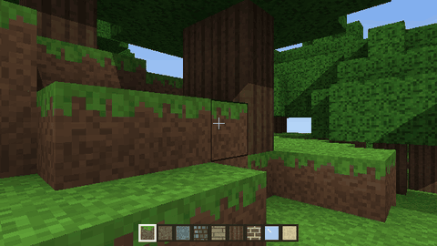
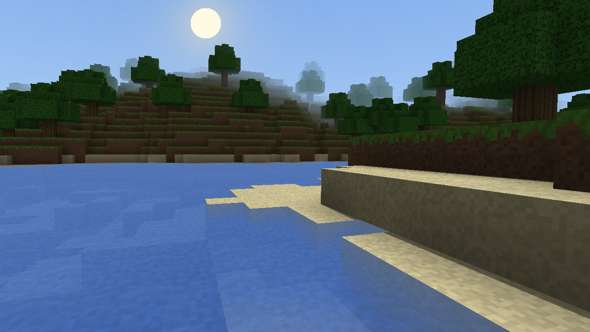
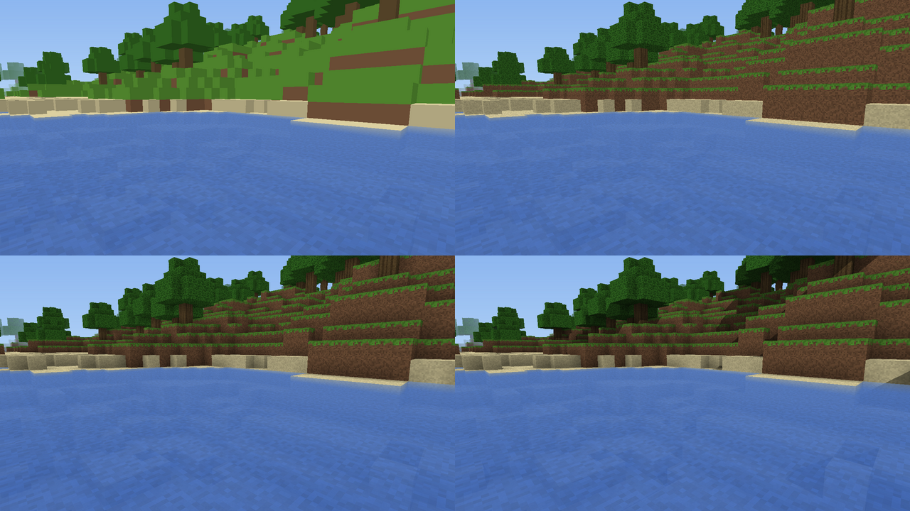

# bend-craft

A block world in Bend 2: generated terrain, a first-person player who walks,
swims, breaks and places blocks, and a per-pixel voxel ray tracer. The whole
game is U32 fixed point, so a run is a function of its seed and its input log,
and every frame is the same bytes on every lane: JS, native on 1 or 16
threads, and the GPU.

This is a community project. It is not part of Bend and is not maintained by
the Bend authors. It is not affiliated with, endorsed by or connected to
Mojang or Minecraft; it only borrows the idea of a block world.





- `world.bend`: the world as one flat `Array<U32>` (a byte a block, four per
  word along y, chunks of 16 x 16 columns) and its terrain: a height map, then
  every column's words gathered from it, as two fork trees.
- `render.bend`: the view. Amanatides-Woo DDA per sample over the world
  array, with a hard step cap. Four tiers: flat colours, textures, ambient
  occlusion, and a shadow ray per lit face. It writes a flat row-major
  framebuffer (`R.fill`), or also the window `Image` (`R.draw`).
- `game.bend`: the player on `loop.bend`'s contract: a pure 60 Hz `step`
  (look, move and collide one axis at a time, jump, swim, break, place), the
  hotbar, and `render(state)`.
- `play.bend`: the game in a window (keys below). `PLAY_DEMO=1` plays a
  scripted walk instead of the keyboard and mouse, which is what the
  benchmarks run.
- `blit.c` / `blit.js`: `Blit.frame`, this project's own foreign effect. It
  shows the framebuffer in the window that `Window.open` made (see Showing a
  frame). `blit_ok.c` / `blit_ok.js`: `Blit.ok`, which says whether it can
  run here.
- `fx.bend`: signed 16.16 arithmetic, sine and cosine on U32.
- `clock.c` / `clock.js`: `Clock.us`, a monotonic microsecond clock (play and
  bench only).
- `loop.bend`, `input.bend`, `rng.bend`: bend-game's loop, input and random
  numbers, unchanged (see Credits).

Nothing reads a clock or a device except `play.bend` and the benches.

## Play

```
bend play.bend -o play && ./play                   # checked with upstream main ef66a7cc (after 2.0.32)
PLAY_W=1920 PLAY_H=1080 PLAY_U=1 ./play            # render 960x540, show it at 1080p
```

Keys: WASD move, space jumps (and swims up), the mouse or the arrows turn and
look, the left button or Q breaks, the right button or E places, 1-9 pick the
block, P pauses, Esc or closing the window quits.

Mouse look: click in the window and it holds the pointer (hidden, kept in the
window), so the mouse turns you as far as you move it; Esc lets the pointer go,
and a second Esc quits. `PLAY_GRAB=0` turns the hold off. This is `Blit.frame`'s
own event pump (`blit.c`), so it works on every runtime bend-craft builds on;
with `PLAY_MODE=1` the mouse still turns you, but only while the pointer is in
the window.

Settings are environment variables. They are listed at the top of
`play.bend`. The ones that matter most:

- `PLAY_W`, `PLAY_H` (1280 x 720): the window.
- `PLAY_U` (0): the upscale. Frames are rendered at `W / 2^U` by `H / 2^U`
  samples, and each sample is shown as a 2^U-pixel square.
- `PLAY_TIER` (3) and `PLAY_VD` (48): the shading tier and the view distance
  in blocks. Tier 3 at 48 is the default and what every number below uses.

  
- `PLAY_SKIP`: shortcuts that keep the frames identical. Bit 0: empty-space skipping over the
  occupancy words. Bit 1: the sun table (a shadow ray that starts above its column's height is
  lit without a walk). The default is 3 on the CPU and 0 on the GPU, where neither helped (bit 1
  costs 0.5 ms there).
- `PLAY_MODE`: how a frame reaches the window. The default is 2 (`Blit.frame`)
  where `Blit.ok` says it runs, and 1 (`Window.frame`) everywhere else.

On the CPU, 16 threads render 640 x 360 in about 15 ms (a little over the budget at
its slowest frames) and 480 x 270 in about 9 ms. So on a CPU, play with `PLAY_U=2`: a
1920 x 1080 window holds 60 fps.

## The GPU lane

The GPU numbers here come from the CUDA-over-HIP tree (pr/gpu-profile,
Bend's CUDA backend running on an RX 7800 XT through a HIP shim, under WSL2),
not from a released Bend:

```
tools/cbuild.sh gpu play.bend build/play cuda     # emit C with that tree, compile on the CPU
build/play --gpu-build                            # build the GPU program (opens a GPU context)
build/play --threads 16 --gpu 3GB
```

The render is one bang: one GPU turn a frame. It is a fork tree of 2^14
leaves. Leaf i traces samples i, i + 2^14, and so on. That way every leaf gets
rays from the whole frame, and neighbouring lanes trace neighbouring rays. The
sim runs on the host between turns, because a tick is a short serial chain.

## Showing a frame

There are three ways to get a frame from the framebuffer to the window
(`PLAY_MODE`):

- **0:** render straight into the window `Image`. The fork tree is the
  quadtree, so there is no framebuffer at all. It is slower: every tile is a
  leaf that allocates.
- **1:** render into the framebuffer, convert it into an `Image` in the same
  bang, then call `Window.frame`. This is portable, and it is the fallback.
- **2:** render into the framebuffer, then call `Blit.frame`. It copies the
  framebuffer straight into the window's pixels, which are 0x00RRGGBB like
  the framebuffer. There is no `Image` and no conversion pass.
  - The copy goes into a shared-memory XImage (MIT-SHM), and the server
    reads it in place. There are two such images, and each one is reused
    only once the server's ShmCompletion event says it has finished
    reading it.
  - With an upscale (`PLAY_U` > 0), the image holds the samples only. It
    is put into a pixmap, and XRender draws that pixmap onto the window
    through a 1/2^U scale with the "nearest" filter, so the X server does
    the upscale, not the game. Without XRender, or with `PLAY_XR=0`, the
    game upscales itself: it widens each sample row once and copies it,
    split over 4 threads for large windows.
  - On the GPU lane the copy down is one `cuMemcpyDtoH` into page-locked
    memory.
  - Mode 2 shows the same pixels as mode 1, on the CPU and GPU lanes.

**What `blit.c` depends on.** It is a package effect that uses runtime
internals:

- **The window block.** It reads `BendWin`, the struct that `window_open.c`,
  `window_frame.c` and `window_close.c` share. blit.c keeps its own copy
  under the same guard, so a change to that struct upstream breaks
  `Blit.frame`.
- **Array locations.** It reads the framebuffer's location with `blk_loc`.
- **The twin heap (GPU lane).** It reads `gpu_twin`, `gpu_vram`,
  `gpu_state`, `gpu_sync` and `io_gpu`, the host and device copies of the
  heap from the HIP lane's runtime (the #1078 work). That code compiles
  only where the runtime defines the twin (`GPU_DIRTY`). A CUDA runtime
  without it reads `e.mem`, as upstream's `window_fill` does.
- **libXext.** It opens `libXext.so.6` at run time for MIT-SHM, because
  the game links only libX11. Without it, without the extension, or with
  `PLAY_SHM=0`, the put falls back to `XPutImage`. In the same way it
  opens `libXrender.so.1` for the server-side upscale, and without it the
  game upscales on the host.

`Blit.ok` is 1 only on Linux with X11, under the same guard as
`window_open.c`. It is 0 elsewhere, and there `play` uses `Window.frame`.
Where each platform stands:

| Platform | Status |
|-|-|
| Linux x86-64, WSLg | built and run on the CPU lane (pr/gpu-profile and upstream main-229) and on the GPU lane (pr/gpu-profile) |
| Upstream main with CUDA | compiles; not run |
| JS | picks mode 1 |
| macOS | only checked by preprocessing `blit.c` and `blit_ok.c` without `__linux__`: they reduce to the stubs and `Blit.ok = 0`; never built on a Mac |
| Linux without X11 | not checked; the runtime's own window needs X11 there anyway |

## Tests

```
./run_tests.sh -l check,js,c1,c16,main,gpu
```

Each `tests/*.bend` ends in `#|` lines holding its expected output. On every
lane, and at several fork depths, it must print exactly those lines. `main` is
a plain CPU build with upstream main (2.0.29, 574b6d39), so the game does not
depend on the fork. `gpu` runs every `!` on the GPU.

- `world.bend` / `world_full.bend`: terrain hashes at fork depths 0 to 14.
  A counting writer checks that every word is written exactly once.
- `render.bend` / `render_full.bend`: tiers 0 to 3 at several fork depths,
  the same framebuffer and `Image` hashes on every lane, and a bounds pass
  (every sample written once, nothing past the frame).
- `game.bend`:
  - a hand-built scene: landing, walls, the world's edge, a jump into a
    slab, a hole;
  - break and place, including placing a block into the player's own box,
    which is refused;
  - a scripted run over generated terrain, then the same run replayed from
    its encoded log;
  - a rendered frame's hash.

`play.bend` runs a real window, so it is not in `run_tests.sh`. Its frames are
compared as P6 files (`PLAY_SHOT=path` writes the window's last frame): mode 1
against mode 2, and each lane against the others. `PLAY_SHOT_SERVER=path`
reads the window back from the X server instead (`XGetImage`), which checks
what the server actually shows, including its upscale.

## Benchmarks

The ladder is: at a given resolution, does the game hold 60 fps in a real
window? The test is on the build that ships, paced at 60 Hz, over 900 frames
of the scripted walk, in 3 rounds or more. Every round must meet all of these:

- the frame's work (busy) at p95 and at p99 within 16.7 ms;
- at most one frame missed;
- the frames identical across lanes.

`OPTIMIZATIONS.md` logs every attempt, including the ones that didn't work.
For each it gives the expected gain, the measured gain and the commit.

Every resolution on both lanes, tier 3, view distance 48, the scripted walk in the real window:

- **fps** is how many frames a second the frame's work allows (1000 / the median busy time). A
  paced game shows 60; above 60 it is headroom, and below 60 it is the frame rate you get.
- **1% low** is 1000 / busy p99 (the worst round).

upN means each sample is N x N pixels (the X server scales it up). The numbers come from
`logs/res-sweep.txt` (2026-09-28); the 3-round rungs are in `OPTIMIZATIONS.md`.

GPU lane, RX 7800 XT (the fork runtime f81948eb, CUDA over HIP):

| Resolution | Samples | fps | 1% low | busy p95 (ms) |
|-|-|-|-|-|
| 320x180 | 320x180 | 236 | 159 | 4.9-5.1 |
| 640x360 | 640x360 | 177 | 144 | 6.3-6.5 |
| 720p up4 | 320x180 | 225 | 173 | 5.1-5.3 |
| 720p up2 | 640x360 | 169 | 121 | 6.6-7.5 |
| 720p | 1280x720 | 94 | 63 | 12.5-12.7 |
| 1080p up4 | 480x270 | 202 | 156 | 5.8 |
| 1080p up2 | 960x540 | 120 | 102 | 9.2-9.4 |
| 1080p | 1920x1080 | 78 | 64 | 14.5-14.6 |
| 1440p up4 | 640x360 | 167 | 130 | 7.0-7.2 |
| 1440p up2 | 1280x720 | 85 | 68 | 13.4-13.7 |
| 1440p | 2560x1440 | 54 | 46 | 21.2 |
| 4K up4 | 960x540 | 110 | 90 | 10.6 |
| 4K up2 | 1920x1080 | 74 | 60 | 15.7 |
| 4K | 3840x2160 | 24 | 21 | 46.2 |

4K up2 is right at the limit. p95 passes, and p99 was 16.7 in the sweep's round and 17.3-17.9 in the
ladder's rounds. A prototype of an upstream compiler change (the array's location read once per ray,
not once per voxel) takes it to p95 15.1-15.4 / p99 16.0-16.2, which passes; see `OPTIMIZATIONS.md`.
1440p native is held by the render kernel.

CPU lane, Ryzen 7 5800XT, 16 threads (upstream main ef66a7cc, no GPU code):

| Resolution | Samples | fps | 1% low | busy p95 (ms) |
|-|-|-|-|-|
| 320x180 | 320x180 | 218 | 179 | 5.2-5.4 |
| 640x360 | 640x360 | 84 | 63 | 14.2-14.5 |
| 720p up4 | 320x180 | 211 | 170 | 5.5-5.6 |
| 720p up2 | 640x360 | 67 | 44 | 18.3-19.5 |
| 720p | 1280x720 | 19 | 15 | 60.7-61.5 |
| 1080p up4 | 480x270 | 114 | 89 | 10.3 |
| 1080p up2 | 960x540 | 32 | 25 | 36.0-36.6 |
| 1080p | 1920x1080 | 9 | 7 | 126-131 |
| 1440p up4 | 640x360 | 66 | 48 | 18.0-19.2 |
| 1440p up2 | 1280x720 | 19 | 14 | 63-66 |
| 1440p | 2560x1440 | 5 | 4 | 206-215 |
| 4K up4 | 960x540 | 31 | 25 | 37.6 |
| 4K up2 | 1920x1080 | 9 | 8 | 124 |
| 4K | 3840x2160 | 2 | 2 | 467 |

The 640x360 row is from the rewritten ray walk (`OPTIMIZATIONS.md` 36, 3 rounds, busy p99
15.3-15.9, 0 missed), which holds 60 fps there; the other rows were measured before it and would be
about 10% faster now. A prototype of an upstream change to the CPU pool (the frontier grown to 8
units a worker, not 1, so a worker that lands on a shared core does not hold up the frame) takes
another 9-20% off (with both, 640x360's p99 is 13.4-13.6); see `OPTIMIZATIONS.md` 31, 35 and 36.

`OPTIMIZATIONS.md` has every attempt and the rounds behind each number. The run log, with
terrain and render sweeps, is `LOG.md`. Screenshots are in `media/`.

## Credits

`loop.bend`, `input.bend` and `rng.bend` are copied unchanged from
bend-game, the community game library for Bend 2. The fixed-timestep loop, the
per-tick input and its log codec, and the counter-based random numbers are its
work. `game.bend` is written against its `Loop` contract, and its laws
(replay, rollback, save and load) carry over to this game's state.

## License

Apache-2.0, the same as Bend. See `LICENSE`.
